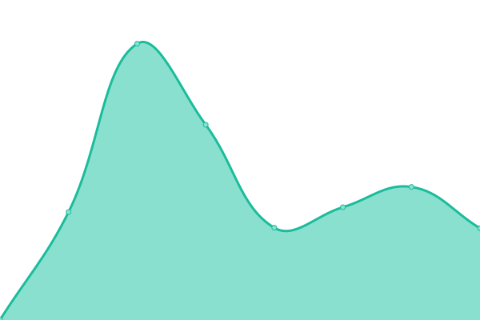
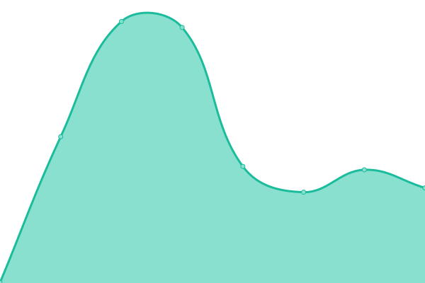
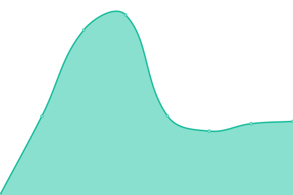

# [📈 Live Status](https://upptime.github.io/upptime): <!--live status--> **🟩 All systems operational**

This repository contains the open-source uptime monitor and status page for [Upptime](https://upptime.js.org), powered by [Upptime](https://github.com/upptime/upptime).

With [Upptime](https://upptime.js.org), you can get your own unlimited and free uptime monitor and status page, powered entirely by a GitHub repository. We use [Issues](https://github.com/upptime/upptime/issues) as incident reports, [Actions](https://github.com/PHACDataHub/upptime/actions) as uptime monitors, and [Pages](https://upptime.github.io/upptime) for the status page.

<!--start: status pages-->
<!-- This summary is generated by Upptime (https://github.com/upptime/upptime) -->
<!-- Do not edit this manually, your changes will be overwritten -->
<!-- prettier-ignore -->
| URL | Status | History | Response Time | Uptime |
| --- | ------ | ------- | ------------- | ------ |
|  [Self-Serve Portal POC](backstage.alpha.phac-aspc.gc.ca) | 🟩 Up | [self-serve-portal-poc.yml](https://github.com/niranjan-ramesh/upptime/commits/HEAD/history/self-serve-portal-poc.yml) | 

 571ms
     
 | 

<a href="https://PHACDataHub.github.io/upptime/history/self-serve-portal-poc">100.00%</a>
    

|  [Safe Inputs POC](safeinputs.alpha.phac-aspc.gc.ca) | 🟩 Up | [safe-inputs-poc.yml](https://github.com/niranjan-ramesh/upptime/commits/HEAD/history/safe-inputs-poc.yml) | 

 563ms
     
 | 

<a href="https://PHACDataHub.github.io/upptime/history/safe-inputs-poc">100.00%</a>
    

|  [HOPIC POC](hopic-sdpac.data-donnes.phac-aspc.gc.ca) | 🟩 Up | [hopic-poc.yml](https://github.com/niranjan-ramesh/upptime/commits/HEAD/history/hopic-poc.yml) | 

 851ms
     
 | 

<a href="https://PHACDataHub.github.io/upptime/history/hopic-poc">100.00%</a>
    

|  [Observatory](observatory.alpha.phac.gc.ca) | 🟩 Up | [observatory.yml](https://github.com/niranjan-ramesh/upptime/commits/HEAD/history/observatory.yml) | 

 179ms
     
 | 

<a href="https://PHACDataHub.github.io/upptime/history/observatory">100.00%</a>
    

<!--end: status pages-->

[**Visit our status website →**](https://upptime.github.io/upptime)

## 📄 License

- Powered by: [Upptime](https://github.com/upptime/upptime)
- Code: [MIT](./LICENSE) © [Anand Chowdhary](https://anandchowdhary.com), supported by [Pabio](https://pabio.com)
- Data in the `./history` directory: [Open Database License](https://opendatacommons.org/licenses/odbl/1-0/)
