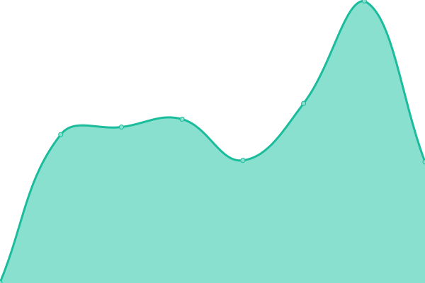
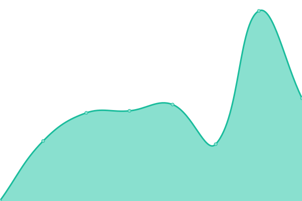
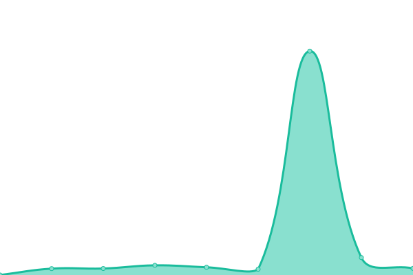
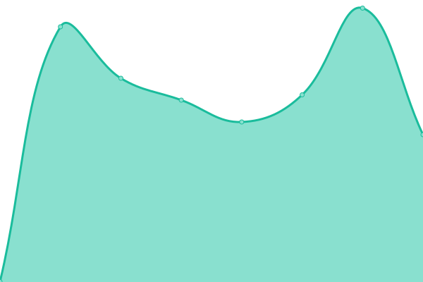
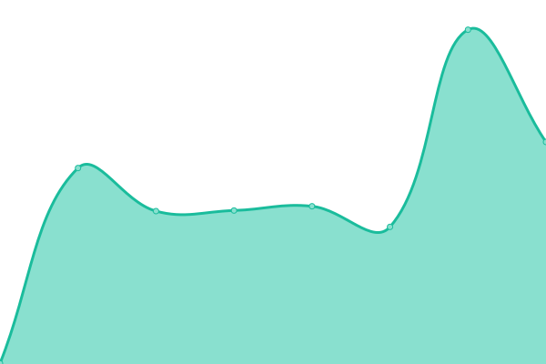

# [📈 Live Status](https://niranjan-ramesh.github.io/upptime): <!--live status--> **🟧 Partial outage**

This repository contains the open-source uptime monitor and status page for [Niranjan Ramesh](https://niranjan-ramesh.github.io/), powered by [Upptime](https://github.com/upptime/upptime).

With [Upptime](https://upptime.js.org), you can get your own unlimited and free uptime monitor and status page, powered entirely by a GitHub repository. We use [Issues](https://github.com/niranjan-ramesh/upptime/issues) as incident reports, [Actions](https://github.com/niranjan-ramesh/upptime/actions) as uptime monitors, and [Pages](https://niranjan-ramesh.github.io/upptime) for the status page.

<!--start: status pages-->
<!-- This summary is generated by Upptime (https://github.com/upptime/upptime) -->
<!-- Do not edit this manually, your changes will be overwritten -->
<!-- prettier-ignore -->
| URL | Status | History | Response Time | Uptime |
| --- | ------ | ------- | ------------- | ------ |
|  [ippm-pigp.alpha.phac-aspc.gc.ca](ippm-pigp.alpha.phac-aspc.gc.ca) | 🟩 Up | [ippm-pigp-alpha-phac-aspc-gc-ca.yml](https://github.com/niranjan-ramesh/upptime/commits/HEAD/history/ippm-pigp-alpha-phac-aspc-gc-ca.yml) | 

 513ms
     
 | 

<a href="https://niranjan-ramesh.github.io/upptime/history/ippm-pigp-alpha-phac-aspc-gc-ca">100.00%</a>
    

|  [paradire.alpha.phac.gc.ca](paradire.alpha.phac.gc.ca) | 🟥 Down | [paradire-alpha-phac-gc-ca.yml](https://github.com/niranjan-ramesh/upptime/commits/HEAD/history/paradire-alpha-phac-gc-ca.yml) | 

 0ms
     
 | 

<a href="https://niranjan-ramesh.github.io/upptime/history/paradire-alpha-phac-gc-ca">0.00%</a>
    

|  [geocoder.alpha.phac.gc.ca](geocoder.alpha.phac.gc.ca) | 🟩 Up | [geocoder-alpha-phac-gc-ca.yml](https://github.com/niranjan-ramesh/upptime/commits/HEAD/history/geocoder-alpha-phac-gc-ca.yml) | 

 694ms
     
 | 

<a href="https://niranjan-ramesh.github.io/upptime/history/geocoder-alpha-phac-gc-ca">100.00%</a>
    

|  [entreessecurisees.alpha.phac-aspc.gc.ca](entreessecurisees.alpha.phac-aspc.gc.ca) | 🟥 Down | [entreessecurisees-alpha-phac-aspc-gc-ca.yml](https://github.com/niranjan-ramesh/upptime/commits/HEAD/history/entreessecurisees-alpha-phac-aspc-gc-ca.yml) | 

 0ms
     
 | 

<a href="https://niranjan-ramesh.github.io/upptime/history/entreessecurisees-alpha-phac-aspc-gc-ca">0.00%</a>
    

|  [shiny.alpha.phac-aspc.gc.ca](shiny.alpha.phac-aspc.gc.ca) | 🟩 Up | [shiny-alpha-phac-aspc-gc-ca.yml](https://github.com/niranjan-ramesh/upptime/commits/HEAD/history/shiny-alpha-phac-aspc-gc-ca.yml) | 

 569ms
     
 | 

<a href="https://niranjan-ramesh.github.io/upptime/history/shiny-alpha-phac-aspc-gc-ca">100.00%</a>
    

|  [safeinputs.alpha.phac-aspc.gc.ca](safeinputs.alpha.phac-aspc.gc.ca) | 🟩 Up | [safeinputs-alpha-phac-aspc-gc-ca.yml](https://github.com/niranjan-ramesh/upptime/commits/HEAD/history/safeinputs-alpha-phac-aspc-gc-ca.yml) | 

 548ms
     
 | 

<a href="https://niranjan-ramesh.github.io/upptime/history/safeinputs-alpha-phac-aspc-gc-ca">100.00%</a>
    

|  [signals-signaux.alpha.phac-aspc.gc.ca](signals-signaux.alpha.phac-aspc.gc.ca) | 🟩 Up | [signals-signaux-alpha-phac-aspc-gc-ca.yml](https://github.com/niranjan-ramesh/upptime/commits/HEAD/history/signals-signaux-alpha-phac-aspc-gc-ca.yml) | 

 541ms
     
 | 

<a href="https://niranjan-ramesh.github.io/upptime/history/signals-signaux-alpha-phac-aspc-gc-ca">100.00%</a>
    

|  [dhis2.beta.phac-aspc.gc.ca](dhis2.beta.phac-aspc.gc.ca) | 🟩 Up | [dhis2-beta-phac-aspc-gc-ca.yml](https://github.com/niranjan-ramesh/upptime/commits/HEAD/history/dhis2-beta-phac-aspc-gc-ca.yml) | 

 948ms
     
 | 

<a href="https://niranjan-ramesh.github.io/upptime/history/dhis2-beta-phac-aspc-gc-ca">100.00%</a>
    

|  [hopic-sdpac.data-donnes.phac-aspc.gc.ca](hopic-sdpac.data-donnes.phac-aspc.gc.ca) | 🟥 Down | [hopic-sdpac-data-donnes-phac-aspc-gc-ca.yml](https://github.com/niranjan-ramesh/upptime/commits/HEAD/history/hopic-sdpac-data-donnes-phac-aspc-gc-ca.yml) | 

 0ms
     
 | 

<a href="https://niranjan-ramesh.github.io/upptime/history/hopic-sdpac-data-donnes-phac-aspc-gc-ca">0.00%</a>
    

|  [catalogue.alpha.phac-aspc.gc.ca](catalogue.alpha.phac-aspc.gc.ca) | 🟥 Down | [catalogue-alpha-phac-aspc-gc-ca.yml](https://github.com/niranjan-ramesh/upptime/commits/HEAD/history/catalogue-alpha-phac-aspc-gc-ca.yml) | 

 422ms
     
 | 

<a href="https://niranjan-ramesh.github.io/upptime/history/catalogue-alpha-phac-aspc-gc-ca">0.00%</a>
    

|  [harbor.alpha.phac.gc.ca](harbor.alpha.phac.gc.ca) | 🟥 Down | [harbor-alpha-phac-gc-ca.yml](https://github.com/niranjan-ramesh/upptime/commits/HEAD/history/harbor-alpha-phac-gc-ca.yml) | 

 594ms
     
 | 

<a href="https://niranjan-ramesh.github.io/upptime/history/harbor-alpha-phac-gc-ca">0.00%</a>
    

|  [ky2.beta.phac.gc.ca](ky2.beta.phac.gc.ca) | 🟥 Down | [ky2-beta-phac-gc-ca.yml](https://github.com/niranjan-ramesh/upptime/commits/HEAD/history/ky2-beta-phac-gc-ca.yml) | 

 0ms
     
 | 

<a href="https://niranjan-ramesh.github.io/upptime/history/ky2-beta-phac-gc-ca">0.00%</a>
    

|  [leandhis2.alpha.phac.gc.ca](leandhis2.alpha.phac.gc.ca) | 🟥 Down | [leandhis2-alpha-phac-gc-ca.yml](https://github.com/niranjan-ramesh/upptime/commits/HEAD/history/leandhis2-alpha-phac-gc-ca.yml) | 

 0ms
     
 | 

<a href="https://niranjan-ramesh.github.io/upptime/history/leandhis2-alpha-phac-gc-ca">0.00%</a>
    

|  [ors-sro.alpha.phac-aspc.gc.ca](ors-sro.alpha.phac-aspc.gc.ca) | 🟩 Up | [ors-sro-alpha-phac-aspc-gc-ca.yml](https://github.com/niranjan-ramesh/upptime/commits/HEAD/history/ors-sro-alpha-phac-aspc-gc-ca.yml) | 

 468ms
     
 | 

<a href="https://niranjan-ramesh.github.io/upptime/history/ors-sro-alpha-phac-aspc-gc-ca">100.00%</a>
    

|  [atip-dlp.alpha.phac.gc.ca](atip-dlp.alpha.phac.gc.ca) | 🟩 Up | [atip-dlp-alpha-phac-gc-ca.yml](https://github.com/niranjan-ramesh/upptime/commits/HEAD/history/atip-dlp-alpha-phac-gc-ca.yml) | 

 693ms
     
 | 

<a href="https://niranjan-ramesh.github.io/upptime/history/atip-dlp-alpha-phac-gc-ca">100.00%</a>
    

|  [backstage.alpha.phac-aspc.gc.ca](backstage.alpha.phac-aspc.gc.ca) | 🟩 Up | [backstage-alpha-phac-aspc-gc-ca.yml](https://github.com/niranjan-ramesh/upptime/commits/HEAD/history/backstage-alpha-phac-aspc-gc-ca.yml) | 

 500ms
     
 | 

<a href="https://niranjan-ramesh.github.io/upptime/history/backstage-alpha-phac-aspc-gc-ca">100.00%</a>
    

|  [jitaccess.alpha.phac-aspc.gc.ca](jitaccess.alpha.phac-aspc.gc.ca) | 🟥 Down | [jitaccess-alpha-phac-aspc-gc-ca.yml](https://github.com/niranjan-ramesh/upptime/commits/HEAD/history/jitaccess-alpha-phac-aspc-gc-ca.yml) | 

 0ms
     
 | 

<a href="https://niranjan-ramesh.github.io/upptime/history/jitaccess-alpha-phac-aspc-gc-ca">0.00%</a>
    

|  [llm.alpha.phac.gc.ca](llm.alpha.phac.gc.ca) | 🟩 Up | [llm-alpha-phac-gc-ca.yml](https://github.com/niranjan-ramesh/upptime/commits/HEAD/history/llm-alpha-phac-gc-ca.yml) | 

 394ms
     
 | 

<a href="https://niranjan-ramesh.github.io/upptime/history/llm-alpha-phac-gc-ca">100.00%</a>
    

|  [hopic-sdpac.data.phac.gc.ca](hopic-sdpac.data.phac.gc.ca) | 🟩 Up | [hopic-sdpac-data-phac-gc-ca.yml](https://github.com/niranjan-ramesh/upptime/commits/HEAD/history/hopic-sdpac-data-phac-gc-ca.yml) | 

 593ms
     
 | 

<a href="https://niranjan-ramesh.github.io/upptime/history/hopic-sdpac-data-phac-gc-ca">100.00%</a>
    

|  [data-readiness-repository.data.phac.gc.ca](data-readiness-repository.data.phac.gc.ca) | 🟩 Up | [data-readiness-repository-data-phac-gc-ca.yml](https://github.com/niranjan-ramesh/upptime/commits/HEAD/history/data-readiness-repository-data-phac-gc-ca.yml) | 

 1891ms
     
 | 

<a href="https://niranjan-ramesh.github.io/upptime/history/data-readiness-repository-data-phac-gc-ca">100.00%</a>
    

|  [observatory.alpha.phac.gc.ca](observatory.alpha.phac.gc.ca) | 🟩 Up | [observatory-alpha-phac-gc-ca.yml](https://github.com/niranjan-ramesh/upptime/commits/HEAD/history/observatory-alpha-phac-gc-ca.yml) | 

 295ms
     
 | 

<a href="https://niranjan-ramesh.github.io/upptime/history/observatory-alpha-phac-gc-ca">100.00%</a>
    

|  [ky.alpha.phac.gc.ca](ky.alpha.phac.gc.ca) | 🟥 Down | [ky-alpha-phac-gc-ca.yml](https://github.com/niranjan-ramesh/upptime/commits/HEAD/history/ky-alpha-phac-gc-ca.yml) | 

 0ms
     
 | 

<a href="https://niranjan-ramesh.github.io/upptime/history/ky-alpha-phac-gc-ca">0.00%</a>
    

<!--end: status pages-->

[**Visit our status website →**](https://niranjan-ramesh.github.io/upptime)

## 📄 License

- Powered by: [Upptime](https://github.com/upptime/upptime)
- Code: [MIT](./LICENSE) © [Anand Chowdhary](https://anandchowdhary.com), supported by [Pabio](https://pabio.com)
- Data in the `./history` directory: [Open Database License](https://opendatacommons.org/licenses/odbl/1-0/)
